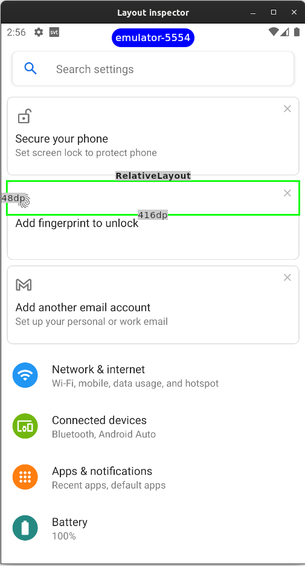
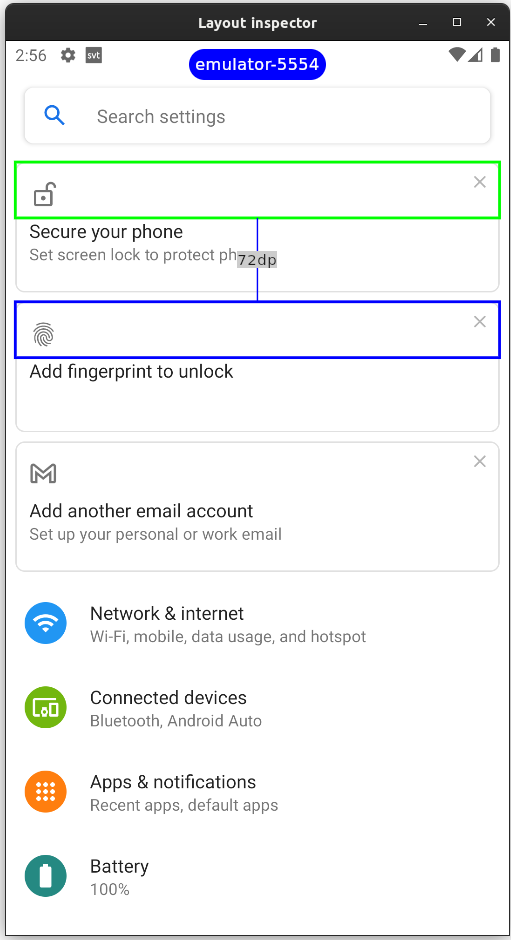
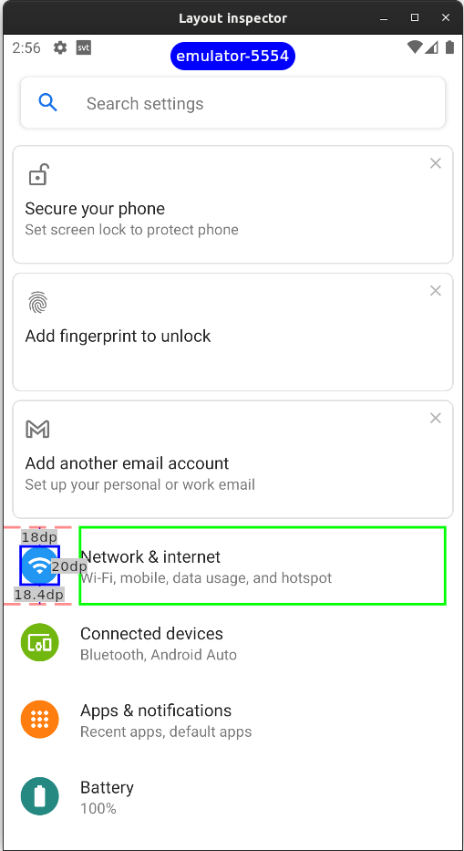
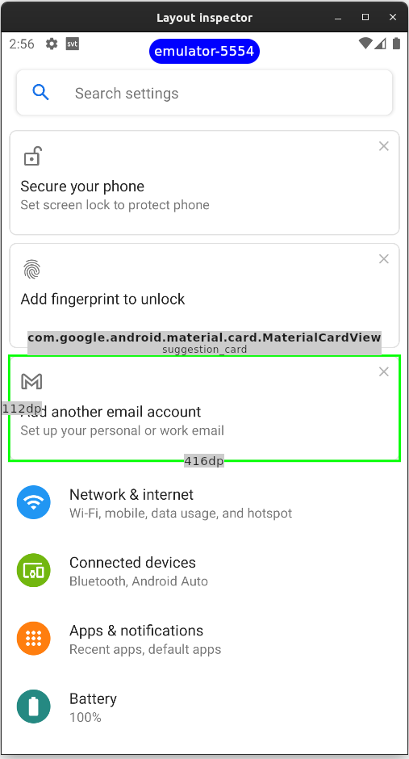

# Layout inspector for Android

Compose desktop application for viewing layouts and measure distance between views. 

- Launches standalone application that connects to device via adb
- Supports multiple devices being connected at the same time
- Shows width and height as well as class and resource if single view is selected
- Shows distance if two views are selected




## Getting started

### Requirements
Adb installed

### Installing

See [releases](https://github.com/ollesate/ComposeAndroidLayoutInspector/releases)

### Running locally

To run program locally requires java 11

```bash
./gradlew run
```

## Known issues with application

### Failed to get devices

Adb configuration might be wonky, either it can't be found or it's a different version from what you normally use.

The application will prompt you to define what adb to run. Enter it into the text field. Run `which adb` to find it. This is then saved as `~/.ComposeAndroidLayoutInspector`.

### Selection box is cropped

For some reason on a device such as Pixel3XL the selection box does not span the whole view. it seems this is an issue with 
`uiautomator  dump` command not getting correct layout. If you are using an emulator try to use a different version.
